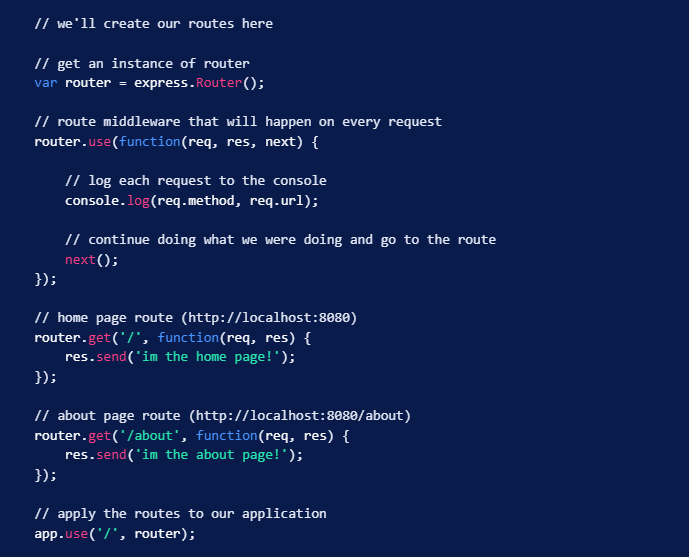

## Express REST API

### ES6 Classes 
1. Classes are a template for creating ____.
- Classes are a template for creating objects.
- They encapsulate data with code to work on that data. 
- Classes in JS are built on prototypes but also have some syntax and semantics that are not shared with ES5 class-like semantics. 
- The class syntax has two components: class expressions and class declarations. 
- Class expression is another way to define a class.

2. Can a class declaration be hoisted?
- Class declaration is defining a class. 
- An important difference between function declarations and class declarations is that while functions can be called in code that appears before they are defined, classes must be defined before they can be called. 
- Hoisting refers to the process where the declaration of the functions, variables, or classes happen prior to execution of the code. 

3. How would you describe a constructor and contextual “this” to a non-technical friend?
- Constructor is a special method for creating and initializing an object created with a class. 
- A constructor can use the 'super' keyword to call the constructor of the super class. 
- 'this' is bound to the new object being constructed. The value of this becomes the value of the new expression unless the constructor returns another non-primitive value. 

### Using Express Routing 
1. Within Express, what does routing refer to?
- Routing refers to how an app's endpoints (URIs) respond to client requests.
- Defined as using methods of the Express app object that correspond to HTTP methods: ex. app.get handles GET requests. 
- The routing methods specify a callback function - handler functions - when the app receives the request to the specified route (endpoint) and HTTP method. 
- It can have multiple callbacks, ex. next();

2. What is the difference between a route path and a route method?
- Route method: derived from one of the HTTP methods and is attached to an instance of the express class. ex. app.get, app.post. 
- Route path: in combo with a request method, define the endpoints at which requests can be made. app.get('/').

3. When is it appropriate to add next as a parameter to a route handler and what must you do if next has been passed to your middleware as a parameter?
- If you want to continue routing to the next route handler in chain that matches this route. You call it with no parameters, next();. This is most often used in middleware. app.use.

## Express Routing

1. What is an Express Router?
- A mini app without that just involves the routing part of an Express app. 

2. By what mean do we initialize express.Router() in an express server?
- You can apply routes to it in order to create frontend routes for our app. Then tell your app to use these routes, ex. app.use('/', router);.
- We can create multiple express.Router()s and apply them to our app. They can be used for basic routes, authenticated routes, and even API routes. 

3. What do we use route middleware for?
- Route middleware is used when something has to happen before a request is processed. ex. checking for authentication, logging data for analytics, or anything else before sending information back to our user. 

- My learning goals are to be able to implement the use of express.Router() and routes into my express app. 