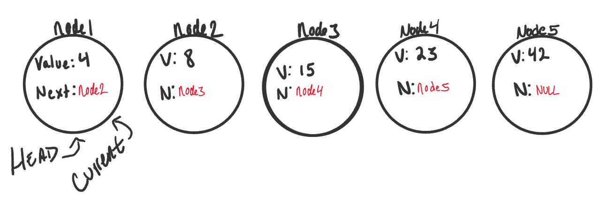
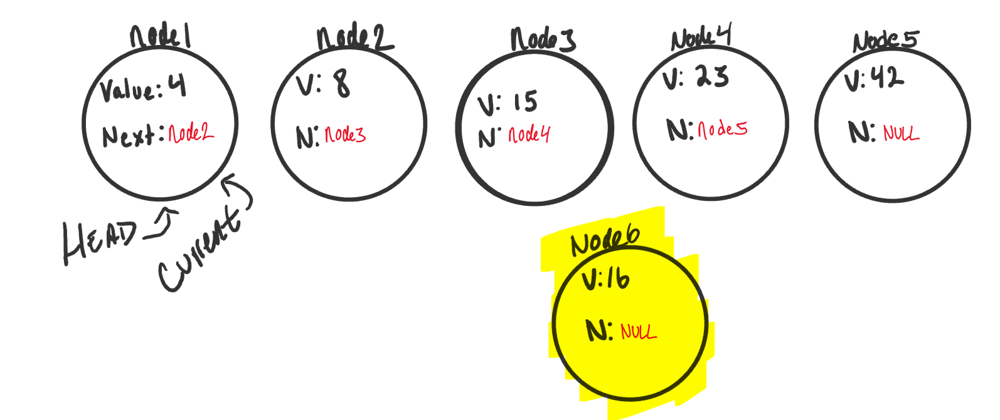
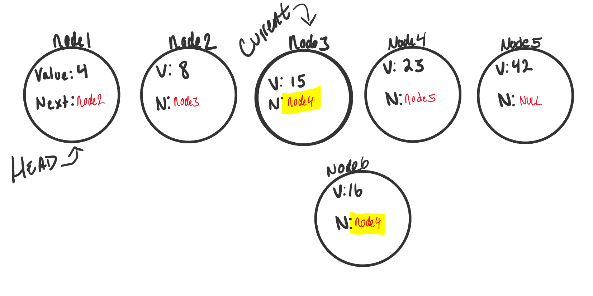
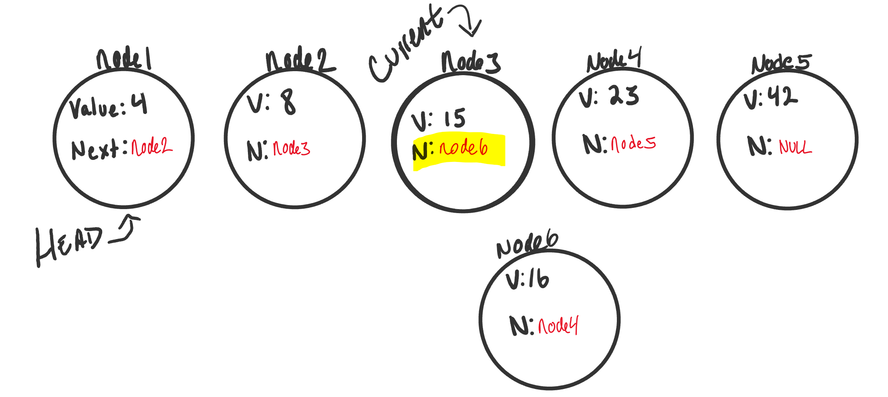
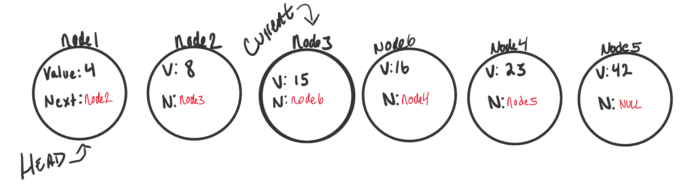

## Linked List

### Terminology 
- **Linked List**: Data structure that contains nodes that links/points to next node in list
- **Singly**: Refers to number of references the node has. It means there is only one reference and the reference points to the next node in a linked list. 
- **Doubly**: Refers to there being double references within the node. Means there is a reference to both the Next and Previous node. 
- **Node**: Individual items/links that live in a linked list. Each node contains data for each link.
- **Next**: Each node contains a property called Next. Contains the reference to the next node. 
- **Head**: Reference of type Node to the first Node in a linked list.
- **Current**: Reference of type Node to the node that is currently being looked at. When traversing, you can create a new Current variable at the Head to guarantee you are starting from beginning of the linked list. 

### What it looks like

### Traversal
- When traversing a linked list, you can't use **foreach** or **for** loop. We depend on the Next value in each node to guide where the next reference is pointing.
- The Next property is exceptionally important because it leads us where the next node is and allows data to be extracted appropriately. 
- The best approach is a **while** loop. This allows us to continually check the Next node for null. 
- If we traverse a node that is null, a **NullReferenceException** gets thrown and our program will crash. 
- When traversing, the Current variable will tell us where exactly in the linked list we are and allow us to traverse forward. 

## Traversal Example
- Using **inclue** to check if our LinkedList includes a specific value. 

 

`ALGORITHM Includes (value)`  
`// INPUT <-- integer value`  
`// OUTPUT <-- boolean`    

 ` Current <-- Head`   

 ` WHILE Current is not NULL`  
`    IF Current.Value is equal to value`  
`     return TRUE`  

    Current <-- Current.Next

  `return FALSE`

- The Big O of time for **includes** would be O(n).
- The Big O of space for **includes** would be O(1).

### Adding a Node (Adding O(1))
- Order of operations is extremely important when working with LinkedList. You must be careful that all references to each link/node is properly assigned. 
- If we want to add a node with an O(1) efficiency, we have to replace current Head of linked list with the new node, without losing reference to the next node in the list.

 

### Add Code

`ALGORITHM Add(newValue)`   
`// INPUT <-- Value to add`  
`// OUTPUT <-- No output`    

  `newNode <-- NEW Node`  
  `newNode.Value <-- newValue` 
  `newNode.Next <-- Head` 
  `Head <-- newNode`

### Add Big O
- Regardless of number of Nodes a LinkedList has, it will always be O(1) time and space because t takes the same amount of time to add a new node to the beginning of the list and no additional resources used. 

### Adding Node O(n)
- Adding node to the middle of a LinkedList is a bit different. This is because we are working with more nodes and must re-allocate to make room for the new node. 

 

### AddBefore Code
`ALGORITHM AddBefore(newValue, valueToAddBefore)`  
`// INPUT <-- New value, Value to add before`  
`// OUTPUT <-- boolean`   

 ` Current <-- Head`   

 ` IF Current is equal to NULL`  
  `  return FALSE`  

`  WHILE Current.Next is not equal to NULL`  
`    IF Current.Next.Value is equal to valueToAddBefore`  
      `newNode <-- NEW Node`  
      `newNode.Value <-- newValue`  
      `newNode.Next <-- Current.Next`  
     ` Current.Next <-- newNode`  
   `   return TRUE`  

 `   Current <-- Current.Next;`  

 ` return FALSE`

### AddBefore Big O
- The time efficiency would be O(n) because we could be inserting the new node, worst case, at the end. With n being number of nodes possible, we would therefore have O(n).
- Space would stay at O(1) because no additional space is being used. 

### Print Out Nodes
- Similar to what was done in the **includes** method. 
- Leveraging our Current node and a while loop to traverse through the existing LinkedList. 

`ALGORITHM Print()`  
`// INPUT <-- None`  
`// OUTPUT <-- string to console`   

`  Current <-- Head`   

`  WHILE Current is not equal to NULL`  
`    OUTPUT <-- "{Current.Value} --> "`  
`    Current <-- Current.Next`   

`  OUTPUT <-- "NULL"`